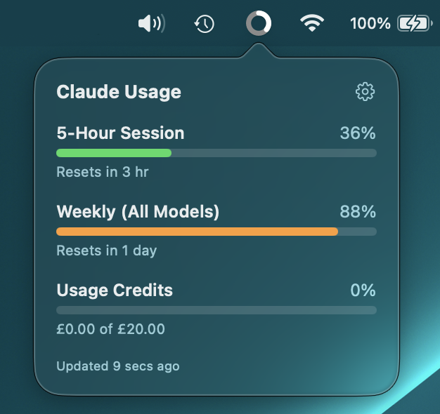
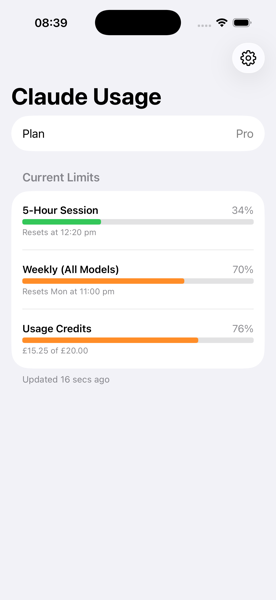
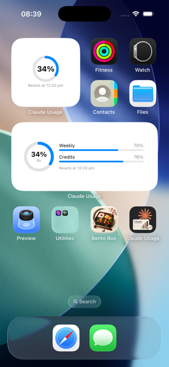
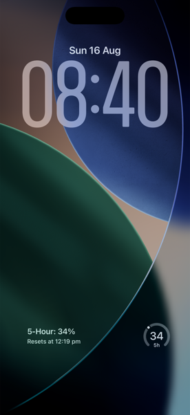

# Claude Usage Monitor

A native macOS menu bar app, iOS app, and iOS widget that show your Claude account's usage
limits at a glance.



**macOS**
- Menu bar icon: a hollow circle that fills white, clockwise from 12 o'clock, as your current
  5-hour session usage climbs from 0% to 100%. Settings lets you switch the display between
  the ring alone, ring + percentage, percentage alone, or percentage stacked over the 5-hour
  reset time (with or without the ring).
- Click the icon for a breakdown of all three limits: the 5-hour session limit, the weekly
  all-model limit, and usage credits, with a sparkline of your recent session peaks under the
  5-hour bar.
- A gear icon in that popover opens Settings: account details, current limits, the menu bar
  display style, a Launch at Login toggle, a Usage History window, Sign Out, and Quit.

**iOS**
- The app mirrors the same breakdown (5-hour session, weekly, usage credits) with pull-to-
  refresh, a History screen, and a Settings screen for account details and Sign Out.
- A Home Screen widget (small/medium) and Lock Screen widgets (circular/inline/rectangular)
  show the same numbers without opening the app.

<p align="center">
  
  
  
</p>

## How it works

There's no public Anthropic API for personal account usage stats. Both apps authenticate the
same way the claude.ai web app does (an embedded login window captures your session cookie,
stored in Keychain) and call the same internal endpoint claude.ai's own frontend uses:
`GET https://claude.ai/api/organizations/{organization_id}/usage`.

That endpoint is undocumented and unversioned — it could change or break without notice. This
is a personal utility built around it, not a supported integration.

The networking, models, credential storage, and login logic live in a local Swift Package,
`Packages/ClaudeUsageKit`, shared by all three targets (mac app, iOS app, widget extension) —
see [Project layout](#project-layout) below.

## Usage history

The usage endpoint reports only the current numbers — there's no history in it — so the apps
record their own. Every poll (the mac app's timer, the iOS app's foreground poll and background
refresh, and the widget's own timeline fetches) appends a sample and updates a per-window
aggregate under `~/Library/Application Support/ClaudeUsageMonitor/UsageHistory/` on macOS and the
App Group container on iOS, keyed by organization.

Windows are identified by their `resets_at`, and utilization only climbs until a reset, so the
peak across however many samples got caught summarises a window well even when coverage was
patchy. Full-resolution samples are kept for a week; the window aggregates are kept indefinitely.

Plan changes reset every limit, which in the raw numbers is indistinguishable from a window
rolling over normally — except the new readings are measured against a different limit. So
history is segmented into *epochs*, detected on the organization's plan capabilities, and the
windows open at a change are flagged as truncated. Utilization is not comparable across an epoch
boundary; `spend`, being real currency, is.

Both apps chart it: peak-per-window bars for 5-hour sessions and weeks, and a 48-hour timeline
of raw samples. Charts are drawn one epoch at a time and averages are computed within an epoch,
so a plan change never averages two plans into one meaningless number. Bars that are still
running, were only partly recorded, or were cut short by a plan change are faded — their peaks
can't be read as final. macOS puts this in a Usage History window off Settings; iOS in a History
screen off the dashboard. Both offer Clear History.

## Building

Requires Xcode (full IDE, not just Command Line Tools) and [XcodeGen](https://github.com/yonaskolb/XcodeGen):

```bash
brew install xcodegen
xcodegen generate
```

**macOS app:**

```bash
xcodebuild -project ClaudeUsageMonitor.xcodeproj -scheme ClaudeUsageMonitor -configuration Release build
```

The built `.app` will be under Xcode's DerivedData; copy it to `/Applications` for a stable,
permanent install (also avoids the ad-hoc code-signature changing — and Keychain re-prompting —
on every rebuild).

**iOS app + widget:**

Open `ClaudeUsageMonitor.xcodeproj` in Xcode, select the `ClaudeUsageMonitorIOS` scheme, and
run on a Simulator or device. The iOS app and widget extension share an App Group
(`group.com.markwatts.ClaudeUsageMonitor`) so the widget can read the credential the app saves
— this needs a signing team on both the `ClaudeUsageMonitorIOS` and `ClaudeUsageWidget` targets
(a free personal team is enough; App Groups work fine on Simulator without a paid account).
`project.yml`'s `DEVELOPMENT_TEAM` is set to the maintainer's team ID (`2Y2TMF4L4P`); if you're
building this on your own Apple ID, change it there (or override it per-target in Xcode's
Signing & Capabilities) before running `xcodegen generate`.

To add the widget: long-press the Home Screen, tap the `+` in the top corner, and search for
"Claude Usage". Lock Screen widgets are added from the Lock Screen customization UI.

## Project layout

- `Packages/ClaudeUsageKit/` — shared Swift Package: usage API client and response models,
  Keychain-backed credential storage (with optional App Group access group for cross-process
  sharing), the login cookie → credential logic, the `UsageStore` observable state, formatting
  helpers, the widget's App-Group-backed usage snapshot cache, and the usage history recorder
  (see [Usage history](#usage-history)).
- `Sources/ClaudeUsageMonitor/` — macOS app: login window (`WKWebView`), the custom-drawn ring
  icon and `NSStatusItem` controller, and SwiftUI views for the popover and settings window.
- `Sources/ClaudeUsageMonitorIOS/` — iOS app: login sheet (`WKWebView`), the usage dashboard
  and settings screens, and `BGAppRefreshTask` scheduling.
- `Sources/ClaudeUsageWidget/` — the WidgetKit extension: `TimelineProvider` and the Home
  Screen / Lock Screen widget views.
- `Sources/Shared/` — SwiftUI compiled into both app targets: the history charts (Swift Charts
  bar, timeline and sparkline views) and the loader behind them. Small views like `UsageBarRow`
  stay duplicated per platform, where each app styles them to its own conventions; the charts
  are identical on both and too big to keep in two places.
